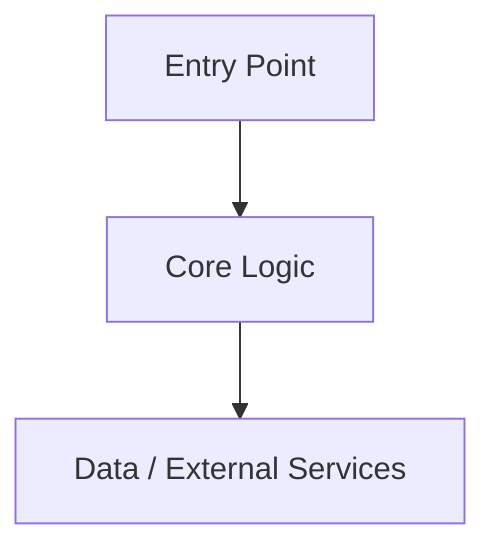

# @nerviq/cli

## Scope
- Primary platform: Codex CLI
- Detected stack: Node.js
- Keep this file focused on Codex-specific guidance when the repo also uses Claude or other agents.

## Architecture

- Replace the default diagram and bullets with the real entry points, boundaries, and high-risk subsystems for this repo.

## Verification
- Test: `npm test`
- Build: `npm run build`

## Coding Conventions
- Prefer small, reviewable diffs and explicit reasoning over broad rewrites.

## Review Workflow
- Use `codex review --uncommitted` before handoff on risky diffs or broad refactors.
- Explain which verification commands ran successfully and which were skipped.
- Keep working-tree expectations explicit: do not silently mix unrelated edits into the same handoff.

## Security
- Never commit secrets, tokens, or `.env` values into tracked files.
- Prefer the repo verification commands before handoff, and explain any command you could not run.

## Cost & Automation
- Reserve heavy reasoning or long automation chains for tasks that actually need them.
- Test Codex automation manually or in workflow_dispatch before turning it into a scheduled workflow.

## Notes
- If this repo also uses Claude, keep Claude-specific instructions in `CLAUDE.md` and use AGENTS.md for Codex-native behavior.
- If you add repo-local skills, place them under `.agents/skills/<skill-name>/SKILL.md` and keep names kebab-case.
- If you add custom agents, keep them under `.codex/agents/*.toml` with narrow sandbox overrides.

_Generated by nerviq v0.9.3 for Codex. Customize this file before relying on it in production flows._
