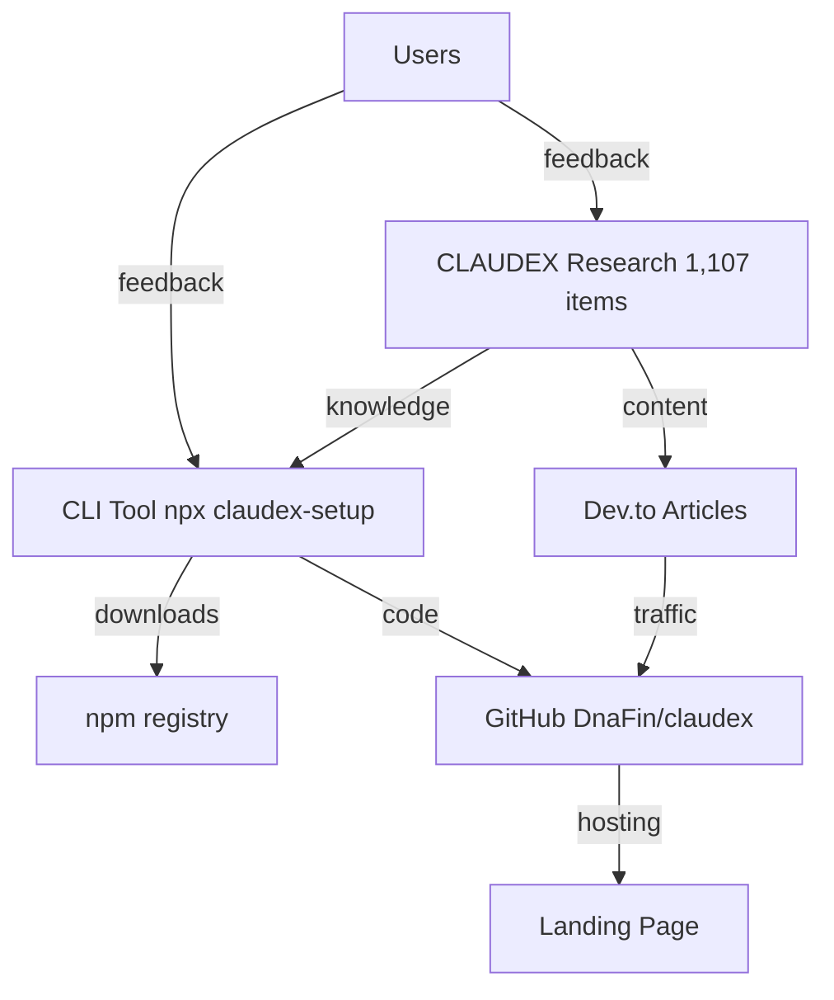

# CLAUDEX-SETUP — Autonomous Product Project

## On Every Session Start
1. Read `apf/state.json` for current metrics
2. Read `apf/todo.md` for pending tasks
3. Check metrics:
   - npm: `curl -s "https://api.npmjs.org/downloads/point/last-week/claudex-setup"`
   - GitHub: `curl -s https://api.github.com/repos/DnaFin/claudex`
   - Dev.to: `curl -s -H "api-key: $DEVTO_API_KEY" https://dev.to/api/articles/me?per_page=5`
4. Update `apf/state.json`
5. Execute highest priority from `apf/todo.md`
6. Before ending: update todo.md + state.json + commit + push

## Credentials
All credentials are in `.env` (gitignored). NEVER hardcode API keys in any tracked file.
- npm: NPM_TOKEN
- GitHub: GITHUB_TOKEN
- Dev.to: DEVTO_API_KEY
- n8n: N8N_API_KEY

## Decision Authority
I decide everything autonomously. Ask human ONLY for:
- Budget approval (any spend > $0)
- New account credentials
- Captcha / manual verification

## Architecture

## Language
- Code: English
- User communication: Hebrew
