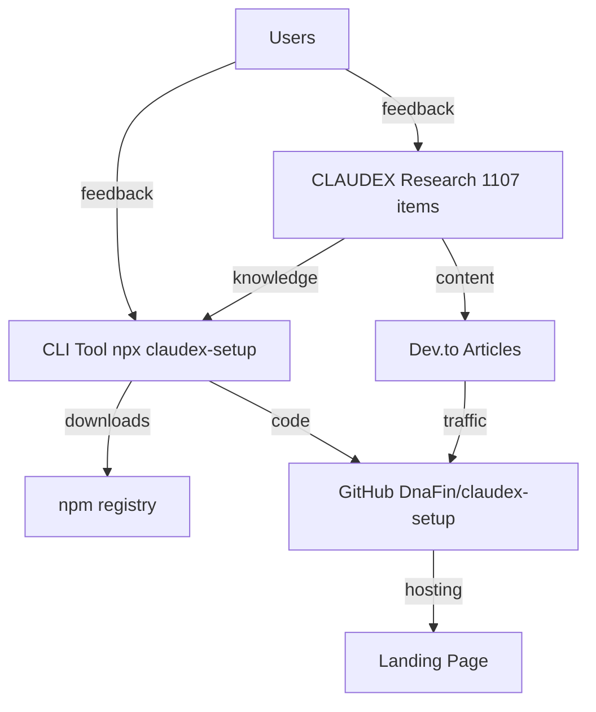

# CLAUDEX-SETUP — Autonomous Product Project

## On Every Session Start
1. Read `apf/state.json` for current metrics
2. Read `apf/todo.md` for pending tasks
3. Check metrics:
   - npm: `curl -s "https://api.npmjs.org/downloads/point/last-week/claudex-setup"`
   - GitHub: `curl -s https://api.github.com/repos/DnaFin/claudex`
   - Dev.to: `curl -s -H "api-key: $DEVTO_API_KEY" https://dev.to/api/articles/me?per_page=5`
4. Update `apf/state.json`
5. Execute highest priority from `apf/todo.md`
6. Before ending: update todo.md + state.json + commit + push

## Credentials
All credentials are in `.env` (gitignored). NEVER hardcode API keys in any tracked file.
- npm: NPM_TOKEN
- GitHub: GITHUB_TOKEN
- Dev.to: DEVTO_API_KEY
- n8n: N8N_API_KEY

## Decision Authority
I decide everything autonomously. Ask human ONLY for:
- Budget approval (any spend > $0)
- New account credentials
- Captcha / manual verification

## Architecture


## Language
- Code: English
- User communication: Hebrew

<!-- claudex-setup:build-test:start -->
## Build & Test
```bash
npm start            # node bin/cli.js
npm run build        # npm pack --dry-run
npm test             # node test/run.js
```
<!-- claudex-setup:build-test:end -->

<!-- claudex-setup:verification:start -->
<verification>
Before completing any task, confirm:
1. All existing tests still pass
2. New code has test coverage
3. No linting errors (`npx eslint .`)
4. Changes match the requested scope (no gold-plating)
</verification>
<!-- claudex-setup:verification:end -->

<!-- claudex-setup:security-workflow:start -->
## Security Workflow
- Run `/security-review` when touching authentication, permissions, secrets, or customer data.
- Treat secret access, shell commands, and risky file operations as review-worthy changes.
<!-- claudex-setup:security-workflow:end -->

<!-- claudex-setup:modularity:start -->
## Modularity
- If this file grows, split it with `@import ./docs/...` so the base instructions stay concise.
<!-- claudex-setup:modularity:end -->

<!-- claudex-setup:working-style:start -->
## Working Notes
- You are a careful engineer working inside this repository. Preserve its existing architecture and naming patterns unless the task requires a change
- Prefer extending existing modules over creating parallel abstractions
- Keep changes scoped to the requested task and verify them before marking work complete
<!-- claudex-setup:working-style:end -->

<!-- claudex-setup:constraints:start -->
<constraints>
- Never commit secrets, API keys, or .env files
- Always run tests before marking work complete
- Prefer editing existing files over creating new ones
- When uncertain about architecture, ask before implementing
- Use const by default; never use var
</constraints>
<!-- claudex-setup:constraints:end -->

<!-- claudex-setup:context-management:start -->
## Context Management
- Use /compact when context gets large (above 50% capacity)
- Prefer focused sessions — one task per conversation
- If a session gets too long, start fresh with /clear
- Use subagents for research tasks to keep main context clean
<!-- claudex-setup:context-management:end -->
