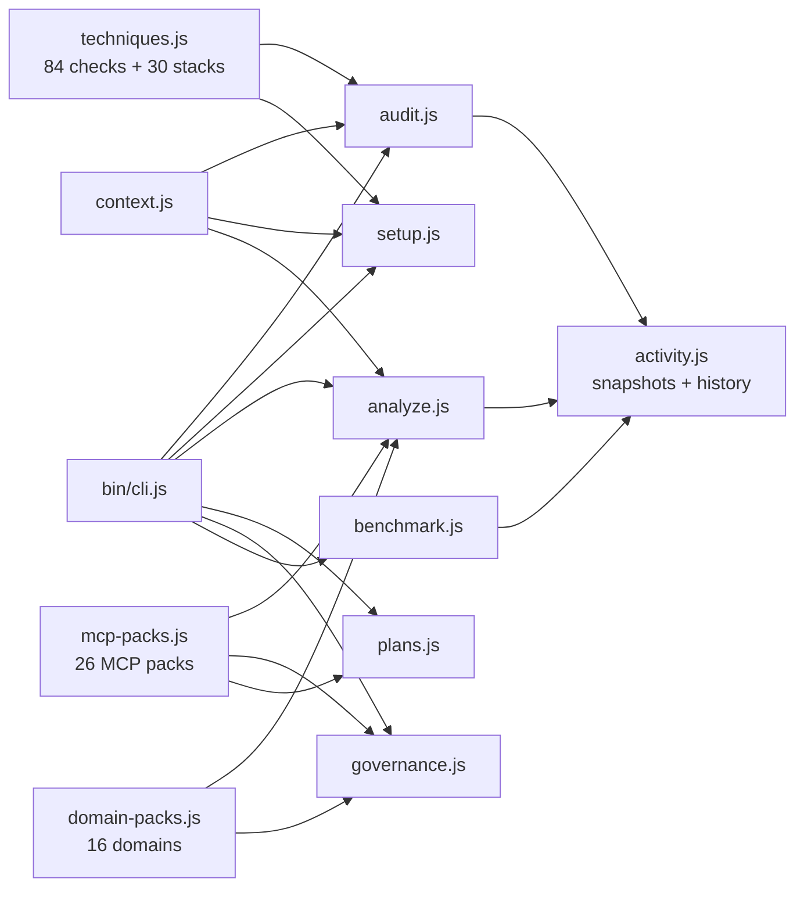

# Architecture

## Data Flow



## Module Responsibilities

| Module | Role | I/O |
|--------|------|-----|
| **context.js** | Scans project directory, caches file reads | Dir path → ProjectContext |
| **techniques.js** | Defines 84 checks + 30 stacks. The knowledge base | ProjectContext → check results |
| **audit.js** | Runs checks, calculates score, builds topNextActions | Options → scored result |
| **analyze.js** | Augment/suggest-only analysis with strengths, gaps, domains | Options → analysis report |
| **plans.js** | Generates proposal bundles, applies with rollback | Audit result → proposals |
| **setup.js** | Generates CLAUDE.md, hooks, commands, agents, skills, rules | Stacks + context → files |
| **governance.js** | Permission profiles, hook registry, policy packs | Config → governance summary |
| **benchmark.js** | Isolated before/after in temp copy | Options → benchmark report |
| **domain-packs.js** | Detects repo type from signals | Context + stacks → domain matches |
| **mcp-packs.js** | Recommends MCP servers per domain | Domains + signals → MCP packs |
| **activity.js** | Snapshots, history, compare, trend export | Payloads → artifact files |

## Scoring

```
Score = (earned / max) * 100

Weights: critical=15, high=10, medium=5, low=2
Organic score: excludes checks that nerviq itself generated
```

Checks return `true` (pass), `false` (fail), or `null` (not applicable / skip).

## Trust-First Flow

```
User runs audit → sees score + gaps
            ↓
User runs plan → sees file previews + rationale
            ↓
User reviews → approves specific bundles
            ↓
apply writes files → rollback manifest created
            ↓
User runs audit again → sees improvement
```

No step writes without the previous step's output being reviewed.
